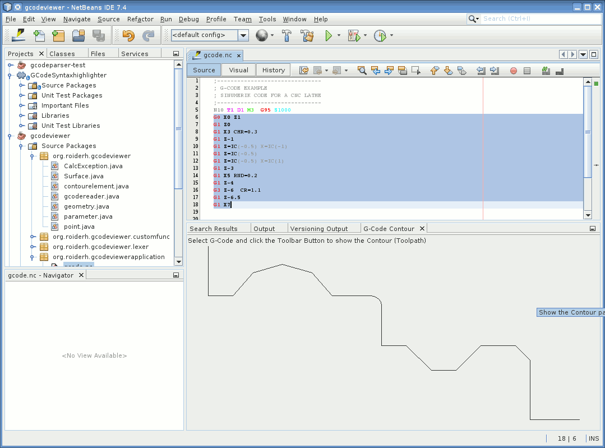

# GCodeViewer

GCodeViewer is a netbeans module to view the toolpath of a piece of g-code. It is not
intend to view the toolpath of the hole file. Only for contour plots of a pice of a file, or subprograms.
It works for CNC Lathe with Sinumerik 840D. Only X and Z axis are plotted. The X-axis is the diameter. 

# Installation

* Download from: http://plugins.netbeans.org/plugin/56657/gcodeviewer
* Go to "Tools" -> "Plugins" -> "Downloaded", click "Add Plugins..." and select the downloaded file org-roiderh-gcode.nbm
* Check the Checkbox and click "Install"

# Usage

Click in menu: "Window" -> "G-Code Contour" to show the output window for the contour plot.

Just select some lines of code and click the toolbar button: 
to show the toolpath. The first line must contain the x and z parameter. 

A screenshot:

