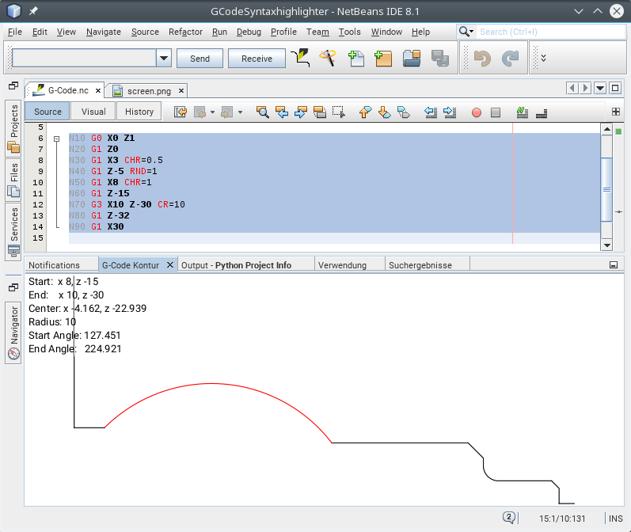

# GCodeViewer

GCodeViewer is a netbeans module to view the toolpath of a piece of g-code. It is not
intend to view the toolpath of the hole file. Only for contour plots of a pice of a file, or subprograms.
It works for CNC Lathe with Sinumerik 840D. Only X and Z axis are plotted. The X-axis is the diameter. 

# Installation

Require NetBeans 11, OpenJDK 11 and OpenJFX 12 or OpenJFX 14

## Prerequisites ##

netbeans.conf (etc/netbeans.conf):

- add to the netbeans_default_options (edit the path to javafx!):

        -J--module-path=<PATH TO javafx-sdk-12.0.1>/lib -J--add-modules=javafx.controls -J--add-exports=javafx.graphics/com.sun.javafx.sg.prism=ALL-UNNAMED  -J--add-exports=javafx.graphics/com.sun.javafx.scene=ALL-UNNAMED -J--add-exports=javafx.graphics/com.sun.javafx.util=ALL-UNNAMED -J--add-exports=javafx.base/com.sun.javafx.logging=ALL-UNNAMED -J--add-exports=javafx.graphics/com.sun.prism=ALL-UNNAMED -J--add-exports=javafx.graphics/com.sun.glass.ui=ALL-UNNAMED -J--add-exports=javafx.graphics/com.sun.javafx.geom.transform=ALL-UNNAMED -J--add-exports=javafx.graphics/com.sun.javafx.tk=ALL-UNNAMED -J--add-exports=javafx.graphics/com.sun.glass.utils=ALL-UNNAMED -J--add-exports=javafx.graphics/com.sun.javafx.font=ALL-UNNAMED -J--add-exports=javafx.graphics/com.sun.javafx.application=ALL-UNNAMED -J--add-exports=javafx.controls/com.sun.javafx.scene.control=ALL-UNNAMED -J--add-exports=javafx.graphics/com.sun.javafx.scene.input=ALL-UNNAMED -J--add-exports=javafx.graphics/com.sun.javafx.geom=ALL-UNNAMED -J--add-exports=javafx.graphics/com.sun.prism.paint=ALL-UNNAMED -J--add-exports=javafx.graphics/com.sun.scenario.effect=ALL-UNNAMED -J--add-exports=javafx.graphics/com.sun.javafx.text=ALL-UNNAMED  -J--add-exports=javafx.graphics/com.sun.javafx.embed=ALL-UNNAMED  -J--add-exports=javafx.graphics/com.sun.javafx.stage=ALL-UNNAMED  -J--add-exports=javafx.graphics/com.sun.javafx.cursor=ALL-UNNAMED

- at the end of the file: 

    for Linux:

        export LD_LIBRARY_PATH=<PATH TO javafx-sdk-12.0.1>/lib

    for Windows or set the PATH Variable in the System Settings or in etc/netbeans.conf:
        
        set PATH=%PATH%;<PATH TO javafx-sdk-12.0.1>/bin

## Install ##

* Download from: http://plugins.netbeans.org/plugin/56657/gcodeviewer
* Go to "Tools" -> "Plugins" -> "Downloaded", click "Add Plugins..." and select the downloaded file org-roiderh-gcode.nbm
* Check the Checkbox and click "Install"

# Usage

Click in menu: "Window" -> "G-Code Contour" to show the output window for the contour plot.

Just select some lines of code and click the toolbar button: 
to show the toolpath. The first line must contain the x and z parameter. 

A screenshot:

